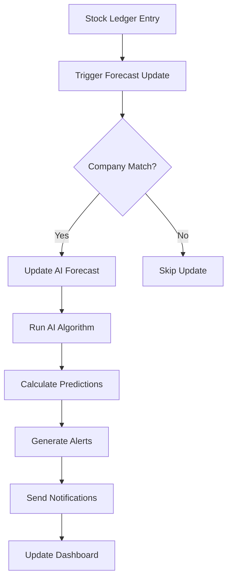

# 🤖 AI Inventory & Sales Forecast for ERPNext

[](https://opensource.org/licenses/MIT)
[](https://github.com/frappe/erpnext)
[](https://www.python.org/)
[](https://github.com/frappe/frappe)
[](https://github.com/tbocloud/ai_inventory)
[](https://github.com/tbocloud/ai_inventory)

An intelligent inventory and sales forecasting system for ERPNext that uses AI algorithms to predict stock consumption patterns, analyze sales trends, generate reorder alerts, and optimize inventory management across multiple companies with comprehensive sales analytics and financial forecasting capabilities.

## � Recent Updates & Improvements

### Version 2.1.5 (August 2025) - Latest Release ✅

#### 🔧 **Critical Fixes & Enhancements**
- **Sync System Overhaul**: Complete redesign of the forecast synchronization system
- **Error Handling**: Robust error management with detailed logging and recovery mechanisms
- **Field Validation**: Fixed Dynamic Link field configurations and select field value validations
- **Sync Logs**: Comprehensive tracking of all forecast sync operations with detailed status reporting
- **DocType Improvements**: Enhanced AI Forecast Accuracy and AI Forecast Sync Log DocTypes

#### 🚀 **New Features**
- **Multi-Type Financial Forecasting**: Support for Financial, Cashflow, Revenue, and Expense forecasts
- **Accuracy Tracking**: Real-time monitoring of forecast accuracy with historical analysis
- **Smart Error Recovery**: Automatic retry mechanisms for failed sync operations
- **Enhanced Logging**: Detailed sync logs with success/failure analytics and timing information

#### 🐛 **Bug Fixes**
- Fixed "No Label must be set first" validation errors
- Resolved Dynamic Link field misconfigurations
- Corrected select field value mappings
- Fixed sync log creation field name mismatches
- Improved error propagation and user feedback

#### 🔍 **Known Issues Resolved**
- ✅ AI Forecast Sync Log creation errors
- ✅ Dynamic Link validation failures
- ✅ Missing required field validations
- ✅ Sync operation error handling
- ✅ Field name mapping inconsistencies

---

## �🌟 Features

### 📊 **AI-Powered Forecasting**
- **Smart Consumption Analysis**: Analyzes historical stock movements to predict future demand
- **Movement Classification**: Automatically categorizes items as Fast Moving, Slow Moving, Non Moving, or Critical
- **Confidence Scoring**: Provides prediction confidence levels (0-100%)
- **Dynamic Forecasting**: Adjusts predictions based on recent consumption patterns
- **Sales Forecasting**: Advanced predictive analytics for sales trends and customer demand patterns
- **Revenue Prediction**: Forecasts future sales revenue with trend analysis and seasonal adjustments
- **Financial Forecasting**: Comprehensive financial forecasting including cashflow, revenue, and expense predictions
- **Multi-Type Sync**: Synchronized forecasting across all financial forecast types with accuracy tracking

### 🏢 **Multi-Company Support**
- **Company-Specific Forecasting**: Separate forecasting logic for each company
- **Cross-Company Analysis**: Compare performance across multiple companies
- **Company-Aware Workflows**: All operations respect company boundaries
- **Consolidated Reporting**: View combined insights across companies

### 🚨 **Intelligent Alerts & Automation**
- **Reorder Alerts**: Automatic alerts when stock falls below optimal levels
- **Auto Purchase Order Creation**: Generate POs automatically when reorder points are reached
- **Email Notifications**: Notify stock managers of critical stock situations
- **Background Processing**: Non-blocking sync operations for large datasets
- **Smart Error Handling**: Robust error management with detailed logging and recovery mechanisms
- **Sync Status Tracking**: Real-time monitoring of forecast synchronization with comprehensive logs

### 📈 **Advanced Analytics & Reporting**
- **Real-time Dashboards**: Live status of inventory across all companies
- **Forecast Accuracy Tracking**: Monitor and improve prediction performance with detailed accuracy metrics
- **Stock Movement Analysis**: Detailed insights into consumption patterns
- **Company Performance Comparison**: Benchmark performance across companies
- **AI Sales Dashboard**: Comprehensive sales analytics with predictive insights per item and customer
- **Sales Trend Analysis**: Advanced metrics including growth rates, volatility, and seasonal patterns
- **Customer Demand Forecasting**: Predict customer purchasing behavior and seasonal demands
- **Financial Analytics**: Complete financial forecasting dashboard with cashflow, revenue, and expense analysis
- **Sync Logs & Monitoring**: Comprehensive tracking of all forecast sync operations with success/failure analytics

### ⚡ **Performance & Scalability**
- **Bulk Operations**: Process thousands of items efficiently
- **Background Sync**: Queue-based processing for large inventories
- **Optimized Queries**: Company-aware database queries for better performance
- **Caching**: Smart caching for frequently accessed data
- **Error Recovery**: Automatic retry mechanisms and graceful error handling
- **Robust Validation**: Comprehensive field validation and data integrity checks

## 🔧 Installation

⚠️ **IMPORTANT**: Install required Python packages BEFORE installing the app to avoid migration errors.

### Prerequisites

- ERPNext v14+ or v15+
- Python 3.8+
- Frappe Framework v14+
- Access to ERPNext site with System Manager privileges

### Quick Installation

```bash
# Navigate to your ERPNext bench
cd /path/to/your/bench

# STEP 1: Install required packages FIRST
./env/bin/pip install numpy>=1.21.0 pandas>=1.3.0 scikit-learn>=1.0.0 matplotlib>=3.3.0 scipy>=1.7.0

# STEP 2: Get the app
bench get-app https://github.com/yourusername/ai_inventory.git

# STEP 3: Install on your site
bench --site your-site-name install-app ai_inventory

# STEP 4: Migrate database
bench --site your-site-name migrate

# STEP 5: Restart services
bench restart

# STEP 6: Clear cache
bench --site your-site-name clear-cache
```

### Alternative: Use Installation Script

```bash
# Download and run the automated installation script
cd /path/to/your/bench
wget https://raw.githubusercontent.com/yourusername/ai_inventory/main/install.sh
chmod +x install.sh
./install.sh
```

### Manual Installation

1. **Clone the Repository**
   ```bash
   git clone https://github.com/yourusername/ai_inventory.git
   cd ai_inventory
   ```

2. **Install Dependencies**
   ```bash
   pip install -r requirements.txt
   ```

3. **Setup in ERPNext**
   ```bash
   bench get-app /path/to/ai_inventory
   bench --site your-site-name install-app ai_inventory
   bench --site your-site-name migrate
   ```

4. **Configure Permissions**
   - Assign "AI Inventory Manager" role to relevant users
   - Configure company-specific permissions as needed

## 🚀 Quick Start

### 1. Initial Setup

1. **Navigate to AI Settings**
   ```
   ERPNext → AI Inventory → AI Settings
   ```

2. **Configure Basic Settings**
   - Enable auto-sync
   - Set sync frequency (hourly/daily)
   - Configure default forecast parameters

### 3. Create Initial Forecasts

```javascript
// Bulk create for all items
Click: Bulk Creation → Create for All Items

// Or create only for items with stock
Click: Bulk Creation → Create for Items with Stock

// Access AI Financial Settings for comprehensive forecasting
Navigate: AI Inventory → AI Financial Settings

// Sync all forecast types (Financial, Cashflow, Revenue, Expense)
Click: Sync All Forecasts

// Access AI Sales Dashboard
Navigate: Reports → AI Sales Dashboard
```

### 2. Multi-Company Configuration

```python
# Set up company-specific forecasting
companies = ["Company A", "Company B", "Company C"]

for company in companies:
    # Create forecasts for each company
    create_forecasts_for_company(company)
    
    # Configure company-specific parameters
    setup_company_parameters(company)
```

### 3. Running Your First Forecast

```python
# Single item forecast
forecast = frappe.get_doc("AI Inventory Forecast", "FORECAST-001")
result = forecast.run_ai_forecast()

# Bulk forecast for a company
sync_ai_forecasts_now(company="Your Company Name")
```

### 4. AI Financial Forecasting

The AI Financial Settings provide comprehensive forecasting capabilities across multiple financial types:

```python
# Access financial forecast data
financial_data = frappe.call({
    'method': 'ai_inventory.forecasting.sync_manager.sync_all_forecasts',
    'args': {
        'company': 'Your Company'
    }
})

# Available forecast types:
# - AI Financial Forecast: General financial predictions
# - AI Cashflow Forecast: Cash flow analysis and predictions  
# - AI Revenue Forecast: Revenue projections and trends
# - AI Expense Forecast: Expense planning and forecasting

# Monitor sync operations
sync_logs = frappe.get_list('AI Forecast Sync Log', 
    filters={'company': 'Your Company'},
    fields=['sync_time', 'sync_type', 'status', 'total_items', 'successful_items']
)
```

#### Financial Forecasting Features

- **Multi-Type Sync**: Synchronize all forecast types with a single operation
- **Accuracy Tracking**: Monitor forecast performance with detailed accuracy metrics
- **Error Handling**: Robust error management with detailed logging
- **Progress Monitoring**: Real-time sync status and completion tracking
- **Historical Analysis**: Track forecast accuracy over time for continuous improvement

## 📖 User Guide - AI Forecast Modules

This section provides comprehensive user documentation for all AI forecasting modules in the AI Inventory system.

---

## 📊 AI Inventory Forecasting Module

The AI Inventory Forecasting module predicts item consumption patterns and generates intelligent reorder recommendations.

### Getting Started

#### 1. Navigate to AI Inventory Forecast
```
ERPNext → AI Inventory → AI Inventory Forecast
```

#### 2. Create Your First Forecast
1. Click **New** to create a forecast
2. Select **Item Code**, **Warehouse**, and **Company**
3. Set **Forecast Period Days** (default: 30 days)
4. Set **Lead Time Days** (default: 14 days)
5. Enable **Auto Create Purchase Order** if desired
6. Click **Save**

#### 3. Run AI Analysis
1. Open your forecast record
2. Click **Run AI Forecast** button
3. Review the AI predictions:
   - **Predicted Consumption**: Expected units to be consumed
   - **Movement Type**: Fast Moving, Slow Moving, Critical, or Normal
   - **Confidence Score**: AI prediction confidence (0-100%)
   - **Reorder Level**: Suggested reorder point
   - **Suggested Qty**: Recommended purchase quantity

### Features

#### 🤖 AI-Powered Predictions
- **Smart Algorithm**: Analyzes historical stock ledger entries to predict future consumption
- **Movement Classification**: Automatically categorizes items based on usage patterns
- **Confidence Scoring**: Provides reliability indicators for each prediction
- **Trend Analysis**: Identifies seasonal patterns and consumption trends

#### 🔄 Automated Operations
- **Auto-Sync**: Scheduled background updates of all forecasts
- **Smart Alerts**: Automatic reorder notifications when stock falls below optimal levels
- **Purchase Order Creation**: One-click PO generation with AI-optimized quantities
- **Multi-Company Support**: Company-isolated forecasting and reporting

#### 📈 Dashboard Analytics
- **Real-time Status**: Live inventory status across all companies
- **Company Comparison**: Benchmark performance across multiple entities
- **Movement Analysis**: Detailed insights into stock consumption patterns
- **Alert Management**: Centralized view of all reorder alerts

### User Workflow

1. **Setup Phase**
   - Configure AI settings for your company
   - Define forecast parameters (period, lead time, safety factors)
   - Set up automated sync schedules

2. **Daily Operations**
   - Monitor reorder alerts in the dashboard
   - Review AI recommendations before creating POs
   - Analyze forecast accuracy and adjust parameters

3. **Analysis & Optimization**
   - Use reports to identify trends and patterns
   - Adjust forecasting parameters based on accuracy
   - Optimize inventory levels using AI insights

### Reports & Analytics

#### Key Reports Available:
- **AI Inventory Dashboard**: Real-time overview of all forecasts
- **Forecast Accuracy Analysis**: Track prediction performance
- **Stock Movement Prediction**: Analyze consumption trends
- **Company-wise Summary**: Multi-company performance comparison

---

## 💰 AI Sales Forecasting Module

The AI Sales Forecasting module provides advanced sales analytics and customer demand predictions.

### Getting Started

#### 1. Access AI Sales Dashboard
```
ERPNext → Reports → AI Sales Dashboard
```

#### 2. Configure Filters
- **Company**: Select your company
- **Date Range**: Set from/to dates for analysis
- **Customer**: Filter by specific customer (optional)
- **Item Code**: Analyze specific items (optional)

#### 3. Analyze Results
The dashboard provides comprehensive sales analytics including:
- **Total Sales**: Revenue figures with growth trends
- **Growth Rate**: Period-over-period growth percentages
- **Volatility Index**: Sales stability indicators
- **Forecast Accuracy**: AI prediction performance
- **Customer Demand Trends**: Buying pattern analysis

### Features

#### 📊 Advanced Analytics
- **Predictive Sales Models**: AI-powered sales forecasting algorithms
- **Customer Behavior Analysis**: Detailed customer purchasing patterns
- **Seasonal Trend Detection**: Identifies cyclical sales patterns
- **Growth Rate Calculations**: Automatic growth trend analysis

#### 🎯 Customer Intelligence
- **Demand Forecasting**: Predict future customer requirements
- **Purchase Pattern Analysis**: Understand buying behaviors
- **Customer Segmentation**: AI-driven customer classification
- **Retention Analytics**: Customer lifetime value predictions

#### 📈 Performance Metrics
- **Sales Growth Tracking**: Monitor sales performance trends
- **Volatility Indicators**: Measure sales stability
- **Accuracy Scoring**: Track forecast precision
- **Comparative Analysis**: Benchmark against historical data

### User Workflow

1. **Daily Monitoring**
   - Check AI Sales Dashboard for current performance
   - Review growth trends and volatility indicators
   - Identify customers with changing demand patterns

2. **Strategic Planning**
   - Use sales forecasts for capacity planning
   - Adjust marketing strategies based on customer insights
   - Plan inventory levels using demand predictions

3. **Performance Review**
   - Analyze forecast accuracy monthly
   - Adjust forecasting models based on performance
   - Generate executive reports using AI insights

---

## 💼 AI Financial Forecasting Module

The AI Financial Forecasting module provides comprehensive financial predictions across multiple forecast types.

### Getting Started

#### 1. Navigate to AI Financial Settings
```
ERPNext → AI Inventory → AI Financial Settings
```

#### 2. Configure Financial Forecasting
1. Select **Company** for financial analysis
2. Choose **Forecast Types**:
   - **Financial Forecast**: General financial predictions
   - **Cashflow Forecast**: Cash flow analysis and predictions
   - **Revenue Forecast**: Revenue projections and trends
   - **Expense Forecast**: Expense planning and forecasting
3. Set forecasting parameters and sync schedules

#### 3. Sync Financial Forecasts
1. Click **Sync All Forecasts** to run comprehensive analysis
2. Monitor sync progress in real-time
3. Review sync logs for detailed operation status

### Features

#### 💹 Multi-Type Forecasting
- **Financial Forecasting**: Comprehensive financial trend analysis
- **Cashflow Predictions**: Cash flow projections with timing analysis
- **Revenue Forecasting**: Sales revenue predictions with growth trends
- **Expense Planning**: Cost forecasting and budget optimization

#### 🔄 Advanced Sync System
- **Unified Sync Operations**: Single-click synchronization across all forecast types
- **Progress Monitoring**: Real-time sync status and completion tracking
- **Error Handling**: Robust error management with detailed logging
- **Accuracy Tracking**: Performance monitoring for continuous improvement

#### 📊 Financial Analytics
- **Trend Analysis**: Identify financial patterns and cycles
- **Variance Analysis**: Compare actual vs. predicted performance
- **Risk Assessment**: Financial risk indicators and alerts
- **Performance Metrics**: Comprehensive financial health indicators

### User Workflow

1. **Initial Setup**
   - Configure financial forecasting parameters
   - Set up automated sync schedules
   - Define accuracy targets and alert thresholds

2. **Regular Operations**
   - Monitor sync operations and logs
   - Review financial forecasts and trends
   - Adjust parameters based on accuracy feedback

3. **Financial Planning**
   - Use cashflow forecasts for liquidity planning
   - Apply revenue predictions for budgeting
   - Utilize expense forecasts for cost control

### Forecast Types Explained

#### 1. AI Financial Forecast
- **Purpose**: General financial trend analysis and predictions
- **Data Sources**: General ledger, profit & loss statements
- **Outputs**: Financial health indicators, trend predictions

#### 2. AI Cashflow Forecast
- **Purpose**: Cash flow timing and liquidity predictions
- **Data Sources**: Accounts receivable, accounts payable, cash transactions
- **Outputs**: Cash flow projections, liquidity alerts

#### 3. AI Revenue Forecast
- **Purpose**: Sales revenue predictions and growth analysis
- **Data Sources**: Sales invoices, sales orders, customer data
- **Outputs**: Revenue projections, growth trends, seasonal patterns

#### 4. AI Expense Forecast
- **Purpose**: Cost planning and expense optimization
- **Data Sources**: Purchase invoices, expense claims, budget data
- **Outputs**: Expense predictions, cost trend analysis, budget variance

---

## 🔧 Advanced Configuration

### AI Settings Configuration

#### Global Settings
```python
# Configure global AI parameters
ai_settings = frappe.get_single("AI Settings")
ai_settings.auto_sync_enabled = 1
ai_settings.sync_frequency = "Daily"
ai_settings.default_forecast_period = 30
ai_settings.default_lead_time = 14
ai_settings.confidence_threshold = 70
ai_settings.save()
```

#### Company-Specific Settings
```python
# Set up company-specific parameters
company_config = {
    "Company A": {
        "forecast_period": 30,
        "lead_time": 10,
        "safety_factor": 1.5
    },
    "Company B": {
        "forecast_period": 45,
        "lead_time": 21,
        "safety_factor": 2.0
    }
}
```

### Bulk Operations

#### Creating Forecasts

```python
# Create forecast for specific item-warehouse-company combination
forecast = frappe.get_doc({
    "doctype": "AI Inventory Forecast",
    "item_code": "ITEM-001",
    "warehouse": "WH-001", 
    "company": "Company A",
    "forecast_period_days": 30,
    "lead_time_days": 14
})
forecast.save()
```

#### Running Forecasts

```python
# Run AI forecast
result = forecast.run_ai_forecast()
print(f"Prediction: {result['predicted_consumption']} units")
print(f"Movement Type: {result['movement_type']}")
print(f"Confidence: {result['confidence_score']}%")
```

#### Bulk Operations

```python
# Sync all forecasts for a company
frappe.call({
    'method': 'ai_inventory.ai_inventory.doctype.ai_inventory_forecast.ai_inventory_forecast.sync_ai_forecasts_now',
    'args': {'company': 'Company A'}
})

# Create forecasts for items with stock
frappe.call({
    'method': 'ai_inventory.ai_inventory.doctype.ai_inventory_forecast.ai_inventory_forecast.auto_create_forecasts_for_items_with_stock',
    'args': {'company': 'Company A'}
})

# Sync all financial forecasts
frappe.call({
    'method': 'ai_inventory.forecasting.sync_manager.sync_all_forecasts',
    'args': {'company': 'Company A'}
})
```

### Custom Forecasting Logic

```python
def custom_forecast_algorithm(historical_data, item_code, company):
    """
    Implement your custom forecasting logic
    """
    # Your algorithm here
    return {
        'predicted_consumption': predicted_value,
        'confidence_score': confidence,
        'movement_type': classification
    }
```

### Company-Specific Reports

```python
# Get company-wise summary
summary = get_company_wise_summary()
for company_data in summary:
    print(f"Company: {company_data['company']}")
    print(f"Total Forecasts: {company_data['total_forecasts']}")
    print(f"Reorder Alerts: {company_data['reorder_alerts']}")
```

---

## 📋 Best Practices

### 1. Data Quality
- Ensure accurate historical data in stock ledger entries
- Maintain consistent item naming and coding
- Regular data cleanup and validation

### 2. Forecasting Parameters
- Start with default parameters and adjust based on accuracy
- Consider seasonal patterns when setting forecast periods
- Use appropriate lead times for your supply chain

### 3. Monitoring & Optimization
- Review forecast accuracy weekly
- Adjust parameters based on performance metrics
- Monitor sync logs for any issues

### 4. Multi-Company Management
- Configure company-specific parameters
- Use company-aware reporting
- Ensure data isolation between companies

### 5. Financial Forecasting
- Regular sync operations for up-to-date predictions
- Monitor accuracy metrics for continuous improvement
- Use multiple forecast types for comprehensive analysis

## 🏗️ Architecture

### System Architecture

```
┌─────────────────┐    ┌─────────────────┐    ┌─────────────────┐
│   Frontend UI   │    │  Backend API    │    │   Database      │
│                 │    │                 │    │                 │
│ • Form Scripts  │◄──►│ • Python Logic  │◄──►│ • MariaDB       │
│ • List Views    │    │ • AI Algorithms │    │ • DocTypes      │
│ • Dashboards    │    │ • Sync Engine   │    │ • Indexes       │
└─────────────────┘    └─────────────────┘    └─────────────────┘
         │                       │                       │
         ▼                       ▼                       ▼
┌─────────────────┐    ┌─────────────────┐    ┌─────────────────┐
│ Multi-Company   │    │  Queue System   │    │ External APIs   │
│ Management      │    │                 │    │                 │
│                 │    │ • Background    │    │ • Email Service │
│ • Company Filter│    │   Jobs          │    │ • Notifications │
│ • Cross-Company │    │ • Sync Tasks    │    │ • Integrations  │
│   Analysis      │    │ • Cleanup       │    │                 │
└─────────────────┘    └─────────────────┘    └─────────────────┘
```

### Data Flow



### DocType Structure

```
AI Inventory Forecast
├── Basic Info
│   ├── item_code (Link to Item)
│   ├── warehouse (Link to Warehouse)
│   ├── company (Link to Company)
│   └── item_name (Read Only)
├── Forecast Parameters
│   ├── forecast_period_days (Int)
│   ├── lead_time_days (Int)
│   └── auto_create_po (Check)
├── Current Status
│   ├── current_stock (Float)
│   ├── last_purchase_date (Date)
│   └── movement_type (Select)
├── AI Predictions
│   ├── predicted_consumption (Float)
│   ├── confidence_score (Percent)
│   ├── reorder_level (Float)
│   ├── suggested_qty (Float)
│   └── reorder_alert (Check)
├── Historical Data
│   ├── historical_data (Long Text)
│   ├── forecast_details (Long Text)
│   └── last_forecast_date (Datetime)
└── Purchase Order
    ├── supplier (Link to Supplier)
    ├── last_po_date (Date)
    └── auto_po_created (Check)
```

## 🔌 API Reference

### Core Methods

#### `run_ai_forecast()`
Executes AI forecasting algorithm for a single item.

```python
result = forecast_doc.run_ai_forecast()
# Returns: {
#     "status": "success",
#     "predicted_consumption": 150.5,
#     "movement_type": "Fast Moving",
#     "confidence_score": 87.3,
#     "reorder_alert": True
# }
```

#### `sync_all_forecasts(company=None)`
Synchronizes all financial forecast types for specified company.

```python
result = sync_all_forecasts(company="Company A")
# Returns: {
#     "status": "success",
#     "total_items": 125,
#     "successful": 120,
#     "failed": 5,
#     "success_rate": 96.0,
#     "forecast_types": ["Financial", "Cashflow", "Revenue", "Expense"],
#     "sync_log_id": "AI-FSYNC-2025-00001"
# }
```

#### `create_forecast_accuracy(forecast_type, reference_id)`
Creates accuracy tracking records for forecast validation.

```python
result = create_forecast_accuracy("Financial", "AI-FIN-FCST-00001")
# Returns: {
#     "status": "success",
#     "accuracy_id": "AI-FACC-2025-00001",
#     "forecast_reference": "AI-FIN-FCST-00001"
# }
```

#### `create_purchase_order()`
Automatically creates purchase order based on forecast recommendations.

```python
result = forecast_doc.create_purchase_order()
# Returns: {
#     "status": "success",
#     "message": "Created new PO: PUR-ORD-2024-00001 for Company A"
# }
```

### Utility Methods

#### `get_company_wise_summary()`
Returns summary statistics for all companies.

```python
summary = get_company_wise_summary()
# Returns: [
#     {
#         "company": "Company A",
#         "total_forecasts": 500,
#         "reorder_alerts": 25,
#         "avg_confidence": 82.5,
#         "fast_moving": 150,
#         "slow_moving": 200,
#         "critical": 10
#     }
# ]
```

#### `bulk_create_forecasts_for_existing_items(company=None)`
Creates forecast records for all stock items.

```python
result = bulk_create_forecasts_for_existing_items(company="Company A")
# Returns: {
#     "status": "success",
#     "forecasts_created": 1500,
#     "company_breakdown": {"Company A": 1500}
# }
```

#### `execute_sales_dashboard(filters=None)`
Generates AI Sales Dashboard with predictive analytics.

```python
result = execute_sales_dashboard({
    "company": "Company A",
    "from_date": "2024-01-01",
    "to_date": "2024-12-31",
    "customer": None,
    "item_code": None
})
# Returns: {
#     "columns": [...],
#     "data": [
#         {
#             "item_code": "ITEM-001",
#             "total_sales": 50000.0,
#             "growth_rate": 15.5,
#             "volatility_index": 0.23,
#             "forecast_accuracy": 87.3,
#             "customer_demand_trend": "Increasing"
#         }
#     ],
#     "chart": {...}
# }
```

#### `get_sync_status(company=None)`
Retrieves current sync operation status and logs.

```python
status = get_sync_status(company="Company A")
# Returns: {
#     "status": "completed",
#     "last_sync": "2025-08-06 10:30:00",
#     "total_operations": 125,
#     "success_rate": 96.0,
#     "active_sync": False,
#     "recent_logs": [...]
# }
```

### Webhook Endpoints

#### `/api/method/ai_inventory.sync_forecasts`
```bash
POST /api/method/ai_inventory.forecasting.sync_manager.sync_all_forecasts
Content-Type: application/json

{
    "company": "Company A"
}
```

#### `/api/method/ai_inventory.get_sync_status`
```bash
GET /api/method/ai_inventory.forecasting.sync_manager.get_sync_status?company=Company%20A
```

#### `/api/method/ai_inventory.sales_dashboard`
```bash
POST /api/method/ai_inventory.ai_inventory.report.ai_sales_dashboard.ai_sales_dashboard.execute
Content-Type: application/json

{
    "filters": {
        "company": "Company A",
        "from_date": "2024-01-01",
        "to_date": "2024-12-31",
        "customer": null,
        "item_code": "ITEM-001"
    }
}
```

## ⚙️ Configuration

### AI Settings DocType

```python
# Configure global AI settings
ai_settings = frappe.get_single("AI Settings")
ai_settings.auto_sync_enabled = 1
ai_settings.sync_frequency = "Daily"
ai_settings.default_forecast_period = 30
ai_settings.default_lead_time = 14
ai_settings.confidence_threshold = 70
ai_settings.save()
```

### Company-Specific Configuration

```python
# Set up company-specific parameters
company_config = {
    "Company A": {
        "forecast_period": 30,
        "lead_time": 10,
        "safety_factor": 1.5
    },
    "Company B": {
        "forecast_period": 45,
        "lead_time": 21,
        "safety_factor": 2.0
    }
}
```

### Scheduled Jobs

```python
# Configure background jobs
scheduler_events = {
    "daily": [
        "ai_inventory.scheduled_tasks.daily_ai_forecast",
        "ai_inventory.hooks_handlers.daily_create_missing_forecasts"
    ],
    "hourly": [
        "ai_inventory.scheduled_tasks.hourly_critical_stock_check"
    ],
    "weekly": [
        "ai_inventory.scheduled_tasks.weekly_forecast_analysis"
    ]
}
```

## 🧪 Testing

### Unit Tests

```bash
# Run all tests
bench --site your-site-name run-tests ai_inventory

# Run specific test
bench --site your-site-name run-tests ai_inventory.tests.test_ai_forecast

# Run with coverage
bench --site your-site-name run-tests ai_inventory --coverage
```

### Sample Test Cases

```python
# Test AI forecasting accuracy
def test_ai_forecast_accuracy():
    forecast = create_test_forecast()
    result = forecast.run_ai_forecast()
    assert result["status"] == "success"
    assert result["confidence_score"] > 0
    assert result["predicted_consumption"] >= 0

# Test multi-company isolation
def test_company_isolation():
    company_a_forecasts = get_forecasts_for_company("Company A")
    company_b_forecasts = get_forecasts_for_company("Company B")
    
    # Ensure no cross-company data mixing
    for forecast in company_a_forecasts:
        assert forecast.company == "Company A"
```

### Performance Testing

```python
# Test bulk operations performance
def test_bulk_sync_performance():
    import time
    start_time = time.time()
    
    result = sync_ai_forecasts_now()
    
    end_time = time.time()
    execution_time = end_time - start_time
    
    # Should complete within reasonable time
    assert execution_time < 300  # 5 minutes max
    assert result["success_rate"] > 90
```

## 🔍 Troubleshooting

### Common Installation Issues

#### 1. "No module named 'pandas'" Error

**Cause**: Required packages not installed before app installation.

**Solution**:
```bash
# Install packages first, then retry migration
./env/bin/pip install numpy pandas scikit-learn matplotlib scipy
bench --site your-site-name migrate
```

#### 2. **Sync Operation Failures**

**Cause**: Field validation errors or missing required data.

**Solution**:
```python
# Check sync logs for detailed error information
sync_logs = frappe.get_list('AI Forecast Sync Log', 
    filters={'status': 'Failed'},
    fields=['sync_time', 'error_details', 'failed_items']
)

# Fix common field validation issues
frappe.call('ai_inventory.forecasting.sync_manager.fix_validation_issues')
```

#### 3. **"No Label must be set first" Error** ✅ FIXED

**Previous Issue**: Dynamic Link field configuration errors.

**Resolution**: Updated to use Data field type for forecast references and fixed all select field value validations.

#### 4. **Forecast Accuracy Tracking Issues** ✅ FIXED

**Previous Issue**: Field name mismatches in AI Forecast Accuracy DocType.

**Resolution**: Standardized field names and updated all references to use `forecast_reference` instead of Dynamic Link fields.

#### 2. **Sync Failures**
```python
# Check for missing companies
missing_companies = frappe.db.sql("""
    SELECT DISTINCT aif.company
    FROM `tabAI Inventory Forecast` aif
    WHERE aif.company NOT IN (SELECT name FROM `tabCompany`)
""")

# Check for disabled items/warehouses
disabled_refs = frappe.db.sql("""
    SELECT aif.name, i.disabled as item_disabled, w.disabled as warehouse_disabled
    FROM `tabAI Inventory Forecast` aif
    LEFT JOIN `tabItem` i ON i.name = aif.item_code
    LEFT JOIN `tabWarehouse` w ON w.name = aif.warehouse
    WHERE i.disabled = 1 OR w.disabled = 1
""")

# Monitor sync operations
recent_syncs = frappe.get_list('AI Forecast Sync Log',
    fields=['sync_time', 'sync_type', 'status', 'total_items', 'successful_items', 'error_details'],
    order_by='sync_time desc',
    limit=10
)
```

#### 3. **Performance Issues**
```python
# Add database indexes
frappe.db.sql("""
    CREATE INDEX idx_ai_forecast_company_item 
    ON `tabAI Inventory Forecast` (company, item_code)
""")

frappe.db.sql("""
    CREATE INDEX idx_ai_forecast_reorder 
    ON `tabAI Inventory Forecast` (reorder_alert, company)
""")
```

### Debug Mode

```python
# Enable debug logging
import logging
logging.basicConfig(level=logging.DEBUG)

# Debug sync operations
def debug_sync_operation(company):
    print(f"🔍 Debugging sync for {company}")
    
    # Check sync status
    status = frappe.call('ai_inventory.forecasting.sync_manager.get_sync_status', 
                        company=company)
    print(f"📊 Sync Status: {status}")
    
    # Check recent logs
    logs = frappe.get_list('AI Forecast Sync Log',
        filters={'company': company},
        fields=['sync_time', 'sync_type', 'status', 'error_details'],
        order_by='sync_time desc',
        limit=5
    )
    print(f"📋 Recent Logs: {logs}")

# Test specific forecast accuracy
def debug_forecast_accuracy(forecast_id):
    accuracy_records = frappe.get_list('AI Forecast Accuracy',
        filters={'forecast_reference': forecast_id},
        fields=['accuracy_score', 'prediction_error', 'last_updated']
    )
    print(f"🎯 Accuracy Records: {accuracy_records}")
```

### Log Analysis

```bash
# Check ERPNext logs for errors
tail -f /path/to/frappe-bench/logs/worker.error.log | grep ai_inventory

# Check database slow queries
tail -f /path/to/mysql/slow-query.log | grep AI_Inventory_Forecast

# Monitor background jobs
bench --site your-site-name doctor

# Check sync operation logs
bench --site your-site-name console
>>> frappe.get_list('AI Forecast Sync Log', fields=['sync_time', 'status', 'total_items'], order_by='sync_time desc', limit=10)
```

### Sync Operation Monitoring

```python
# Real-time sync monitoring
def monitor_sync_operations():
    # Get active sync operations
    active_syncs = frappe.db.sql("""
        SELECT name, sync_type, sync_time, status 
        FROM `tabAI Forecast Sync Log` 
        WHERE status = 'In Progress'
        ORDER BY sync_time DESC
    """, as_dict=True)
    
    # Get recent completed syncs
    recent_syncs = frappe.db.sql("""
        SELECT name, sync_type, sync_time, status, total_items, successful_items
        FROM `tabAI Forecast Sync Log` 
        WHERE status IN ('Completed', 'Failed')
        ORDER BY sync_time DESC 
        LIMIT 10
    """, as_dict=True)
    
    return {
        'active_syncs': active_syncs,
        'recent_syncs': recent_syncs
    }
```

## 🔄 Migration Guide

### From v1.0 to v2.0 (Multi-Company Support)

```python
# Migration script
def migrate_to_multicompany():
    # Add company field to existing forecasts
    forecasts_without_company = frappe.db.sql("""
        SELECT name, warehouse 
        FROM `tabAI Inventory Forecast` 
        WHERE company IS NULL OR company = ''
    """, as_dict=True)
    
    for forecast in forecasts_without_company:
        # Get company from warehouse
        warehouse_company = frappe.db.get_value("Warehouse", forecast.warehouse, "company")
        
        if warehouse_company:
            frappe.db.set_value("AI Inventory Forecast", forecast.name, "company", warehouse_company)
    
    print(f"✅ Migrated {len(forecasts_without_company)} forecasts")

# Run migration
migrate_to_multicompany()
```

### Database Schema Updates

```sql
-- Add company field to AI Inventory Forecast
ALTER TABLE `tabAI Inventory Forecast` 
ADD COLUMN company VARCHAR(180) AFTER warehouse;

-- Add indexes for better performance
CREATE INDEX idx_ai_forecast_company ON `tabAI Inventory Forecast` (company);
CREATE INDEX idx_ai_forecast_company_item ON `tabAI Inventory Forecast` (company, item_code);
CREATE INDEX idx_ai_forecast_reorder_company ON `tabAI Inventory Forecast` (reorder_alert, company);

-- Update existing records
UPDATE `tabAI Inventory Forecast` aif
INNER JOIN `tabWarehouse` w ON w.name = aif.warehouse
SET aif.company = w.company
WHERE aif.company IS NULL OR aif.company = '';
```

## 🤝 Contributing

We welcome contributions! Please follow these guidelines:

### Development Setup

```bash
# Fork and clone the repository
git clone https://github.com/yourusername/ai_inventory.git
cd ai_inventory

# Create development branch
git checkout -b feature/your-feature-name

# Install development dependencies
pip install -r requirements-dev.txt

# Setup pre-commit hooks
pre-commit install
```

### Code Standards

- **Python**: Follow PEP 8 style guide
- **JavaScript**: Use ESLint configuration provided
- **Commit Messages**: Use conventional commit format
- **Documentation**: Update docs for any new features

### Pull Request Process

1. **Create Feature Branch**
   ```bash
   git checkout -b feature/amazing-feature
   ```

2. **Make Changes**
   - Add your code changes
   - Include tests for new functionality
   - Update documentation

3. **Test Your Changes**
   ```bash
   bench --site test-site run-tests ai_inventory
   ```

4. **Submit Pull Request**
   - Provide clear description
   - Reference any related issues
   - Include screenshots for UI changes

### Coding Guidelines

```python
# Use type hints
def run_ai_forecast(self) -> Dict[str, Any]:
    """
    Run AI forecasting algorithm for this item.
    
    Returns:
        Dict containing forecast results with status, predictions, etc.
    """
    pass

# Document complex functions
def complex_algorithm(data: List[Dict]) -> float:
    """
    Complex algorithm description here.
    
    Args:
        data: List of historical consumption records
        
    Returns:
        Predicted consumption value
        
    Raises:
        ValueError: If data is insufficient
    """
    pass
```

## 📋 Roadmap

### Version 2.1 (Q2 2024) ✅ Completed
- [x] AI Sales Dashboard with Predictive Analytics
- [x] Customer Demand Forecasting
- [x] Sales Trend Analysis and Growth Metrics
- [x] Financial Forecasting System (Financial, Cashflow, Revenue, Expense)
- [x] Forecast Accuracy Tracking and Monitoring
- [x] Comprehensive Sync System with Error Handling
- [x] Enhanced Logging and Debug Capabilities

### Version 2.2 (Q3 2024)
- [ ] Machine Learning Integration (TensorFlow/PyTorch)
- [ ] Advanced Seasonality Detection
- [ ] Multi-location Inventory Optimization
- [ ] REST API Enhancements
- [ ] Supplier Performance Analytics
- [ ] Cost Optimization Algorithms
- [ ] Mobile App for Stock Managers
- [ ] Real-time Alerts via WhatsApp/Slack

### Version 3.0 (Q4 2024)
- [ ] Predictive Maintenance Integration
- [ ] IoT Sensor Data Integration
- [ ] Advanced Reporting with BI Tools
- [ ] Multi-currency Support

## 📄 License

This project is licensed under the MIT License - see the [LICENSE](LICENSE) file for details.

```
MIT License

Copyright (c) 2024 AI Inventory Forecast

Permission is hereby granted, free of charge, to any person obtaining a copy
of this software and associated documentation files (the "Software"), to deal
in the Software without restriction, including without limitation the rights
to use, copy, modify, merge, publish, distribute, sublicense, and/or sell
copies of the Software, and to permit persons to whom the Software is
furnished to do so, subject to the following conditions:

The above copyright notice and this permission notice shall be included in all
copies or substantial portions of the Software.

THE SOFTWARE IS PROVIDED "AS IS", WITHOUT WARRANTY OF ANY KIND, EXPRESS OR
IMPLIED, INCLUDING BUT NOT LIMITED TO THE WARRANTIES OF MERCHANTABILITY,
FITNESS FOR A PARTICULAR PURPOSE AND NONINFRINGEMENT. IN NO EVENT SHALL THE
AUTHORS OR COPYRIGHT HOLDERS BE LIABLE FOR ANY CLAIM, DAMAGES OR OTHER
LIABILITY, WHETHER IN AN ACTION OF CONTRACT, TORT OR OTHERWISE, ARISING FROM,
OUT OF OR IN CONNECTION WITH THE SOFTWARE OR THE USE OR OTHER DEALINGS IN THE
SOFTWARE.
```

## 📞 Support

### Community Support
- **GitHub Issues**: [Report bugs and request features](https://github.com/yourusername/ai_inventory/issues)
- **Discussions**: [Community forum](https://github.com/yourusername/ai_inventory/discussions)
- **Wiki**: [Documentation and guides](https://github.com/yourusername/ai_inventory/wiki)

### Commercial Support
- **Professional Services**: Available for custom implementations
- **Training**: On-site and remote training sessions
- **Consulting**: Architecture and optimization consulting

### Contact Information
- **Email**: support@ai-inventory-forecast.com
- **Website**: https://ai-inventory-forecast.com
- **LinkedIn**: [AI Inventory Forecast](https://linkedin.com/company/ai-inventory-forecast)

---

<div align="center">

**⭐ If this project helped you, please consider giving it a star! ⭐**

Made with ❤️ by the AI Inventory Team

[🏠 Home](https://github.com/yourusername/ai_inventory) • 
[📖 Docs](https://github.com/yourusername/ai_inventory/wiki) • 
[🐛 Issues](https://github.com/yourusername/ai_inventory/issues) • 
[💬 Discussions](https://github.com/yourusername/ai_inventory/discussions)

</div>
# 📦 Installation Guide - AI Inventory Forecast

This guide provides detailed step-by-step instructions for installing AI Inventory Forecast on ERPNext.

## 🔧 Prerequisites

### System Requirements

| Component | Minimum | Recommended |
|-----------|---------|-------------|
| **ERPNext** | v14.0 | v15.0+ |
| **Frappe Framework** | v14.0 | v15.0+ |
| **Python** | 3.8 | 3.10+ |
| **MariaDB** | 10.4 | 10.6+ |
| **RAM** | 4GB | 8GB+ |
| **Storage** | 10GB free | 50GB+ free |
| **CPU** | 2 cores | 4+ cores |

### Dependencies

```bash
# Python packages (automatically installed)
pandas>=1.3.0
numpy>=1.21.0
frappe>=14.0.0
erpnext>=14.0.0

# System packages (manual installation required)
sudo apt-get update
sudo apt-get install -y python3-dev python3-pip
sudo apt-get install -y build-essential
```

## 🚀 Quick Installation (Recommended)

### Method 1: Using Bench (Recommended)

```bash
# 1. Navigate to your bench directory
cd /home/frappe/frappe-bench

# 2. Get the app from GitHub
bench get-app https://github.com/yourusername/ai_inventory.git

# 3. Install on your site
bench --site your-site-name install-app ai_inventory

# 4. Migrate database
bench --site your-site-name migrate

# 5. Restart services
bench restart

# 6. Clear cache
bench --site your-site-name clear-cache
```

### Method 2: Using Git Clone

```bash
# 1. Clone the repository
cd /home/frappe/frappe-bench/apps
git clone https://github.com/yourusername/ai_inventory.git

# 2. Install the app
cd /home/frappe/frappe-bench
bench --site your-site-name install-app ai_inventory

# 3. Migrate and restart
bench --site your-site-name migrate
bench restart
```

## 🛠️ Manual Installation (Advanced)

### Step 1: Download and Extract

```bash
# Download the latest release
wget https://github.com/yourusername/ai_inventory/archive/v2.0.0.tar.gz

# Extract
tar -xzf v2.0.0.tar.gz
mv ai_inventory-2.0.0 /home/frappe/frappe-bench/apps/ai_inventory
```

### Step 2: Install Dependencies

```bash
cd /home/frappe/frappe-bench/apps/ai_inventory
pip3 install -r requirements.txt
```

### Step 3: Install on Site

```bash
cd /home/frappe/frappe-bench
bench --site your-site-name install-app ai_inventory
```

### Step 4: Database Migration

```bash
# Run migrations
bench --site your-site-name migrate

# Rebuild search index
bench --site your-site-name build-search-index

# Clear cache
bench --site your-site-name clear-cache
```

## 🔐 Permissions Setup

### 1. Create Custom Roles

```python
# Run in ERPNext console (bench --site your-site-name console)

# Create AI Inventory Manager role
frappe.get_doc({
    "doctype": "Role",
    "role_name": "AI Inventory Manager",
    "desk_access": 1
}).insert()

# Create AI Inventory User role
frappe.get_doc({
    "doctype": "Role", 
    "role_name": "AI Inventory User",
    "desk_access": 1
}).insert()
```

### 2. Configure DocType Permissions

```python
# AI Inventory Forecast permissions
permissions = [
    {
        "role": "AI Inventory Manager",
        "read": 1, "write": 1, "create": 1, "delete": 1,
        "submit": 0, "cancel": 0, "amend": 0
    },
    {
        "role": "AI Inventory User", 
        "read": 1, "write": 0, "create": 0, "delete": 0,
        "submit": 0, "cancel": 0, "amend": 0
    },
    {
        "role": "Stock Manager",
        "read": 1, "write": 1, "create": 1, "delete": 1,
        "submit": 0, "cancel": 0, "amend": 0
    }
]

for perm in permissions:
    frappe.get_doc({
        "doctype": "Custom DocPerm",
        "parent": "AI Inventory Forecast",
        "parenttype": "DocType",
        "role": perm["role"],
        **{k: v for k, v in perm.items() if k != "role"}
    }).insert()
```

### 3. Assign Roles to Users

```python
# Assign roles to specific users
users_roles = {
    "stock.manager@company.com": ["AI Inventory Manager", "Stock Manager"],
    "inventory.user@company.com": ["AI Inventory User"],
    "admin@company.com": ["AI Inventory Manager"]
}

for user, roles in users_roles.items():
    user_doc = frappe.get_doc("User", user)
    for role in roles:
        user_doc.append("roles", {"role": role})
    user_doc.save()
```

## 🏢 Multi-Company Configuration

### 1. Enable Multi-Company Support

```python
# Enable multi-company features
ai_settings = frappe.get_single("AI Settings")
ai_settings.enable_multi_company = 1
ai_settings.company_isolation = 1
ai_settings.save()
```

### 2. Configure Company-Specific Settings

```python
companies = ["Company A", "Company B", "Company C"]

for company in companies:
    # Create company-specific AI settings
    company_settings = frappe.get_doc({
        "doctype": "AI Company
