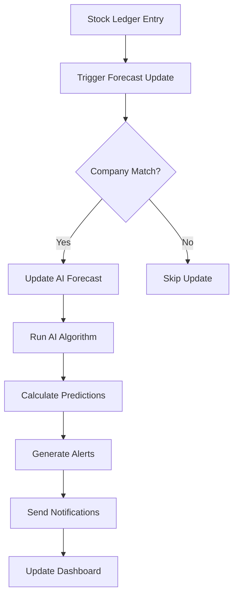

# 🤖 AI Inventory Forecast for ERPNext

[](https://opensource.org/licenses/MIT)
[](https://github.com/frappe/erpnext)
[](https://www.python.org/)
[](https://github.com/frappe/frappe)

An intelligent inventory forecasting system for ERPNext that uses AI algorithms to predict stock consumption patterns, generate reorder alerts, and optimize inventory management across multiple companies.

## 🌟 Features

### 📊 **AI-Powered Forecasting**
- **Smart Consumption Analysis**: Analyzes historical stock movements to predict future demand
- **Movement Classification**: Automatically categorizes items as Fast Moving, Slow Moving, Non Moving, or Critical
- **Confidence Scoring**: Provides prediction confidence levels (0-100%)
- **Dynamic Forecasting**: Adjusts predictions based on recent consumption patterns

### 🏢 **Multi-Company Support**
- **Company-Specific Forecasting**: Separate forecasting logic for each company
- **Cross-Company Analysis**: Compare performance across multiple companies
- **Company-Aware Workflows**: All operations respect company boundaries
- **Consolidated Reporting**: View combined insights across companies

### 🚨 **Intelligent Alerts & Automation**
- **Reorder Alerts**: Automatic alerts when stock falls below optimal levels
- **Auto Purchase Order Creation**: Generate POs automatically when reorder points are reached
- **Email Notifications**: Notify stock managers of critical stock situations
- **Background Processing**: Non-blocking sync operations for large datasets

### 📈 **Advanced Analytics & Reporting**
- **Real-time Dashboards**: Live status of inventory across all companies
- **Forecast Accuracy Tracking**: Monitor and improve prediction performance
- **Stock Movement Analysis**: Detailed insights into consumption patterns
- **Company Performance Comparison**: Benchmark performance across companies

### ⚡ **Performance & Scalability**
- **Bulk Operations**: Process thousands of items efficiently
- **Background Sync**: Queue-based processing for large inventories
- **Optimized Queries**: Company-aware database queries for better performance
- **Caching**: Smart caching for frequently accessed data

## 🔧 Installation

### Prerequisites

- ERPNext v14+ or v15+
- Python 3.8+
- Frappe Framework v14+
- Access to ERPNext site with System Manager privileges

### Quick Installation

```bash
# Navigate to your ERPNext bench
cd /path/to/your/bench

# Install the app
bench get-app https://github.com/yourusername/ai_inventory.git

# Install on your site
bench --site your-site-name install-app ai_inventory

# Migrate database
bench --site your-site-name migrate

# Restart services
bench restart
```

### Manual Installation

1. **Clone the Repository**
   ```bash
   git clone https://github.com/yourusername/ai_inventory.git
   cd ai_inventory
   ```

2. **Install Dependencies**
   ```bash
   pip install -r requirements.txt
   ```

3. **Setup in ERPNext**
   ```bash
   bench get-app /path/to/ai_inventory
   bench --site your-site-name install-app ai_inventory
   bench --site your-site-name migrate
   ```

4. **Configure Permissions**
   - Assign "AI Inventory Manager" role to relevant users
   - Configure company-specific permissions as needed

## 🚀 Quick Start

### 1. Initial Setup

1. **Navigate to AI Settings**
   ```
   ERPNext → AI Inventory → AI Settings
   ```

2. **Configure Basic Settings**
   - Enable auto-sync
   - Set sync frequency (hourly/daily)
   - Configure default forecast parameters

3. **Create Initial Forecasts**
   ```javascript
   // Bulk create for all items
   Click: Bulk Creation → Create for All Items
   
   // Or create only for items with stock
   Click: Bulk Creation → Create for Items with Stock
   ```

### 2. Multi-Company Configuration

```python
# Set up company-specific forecasting
companies = ["Company A", "Company B", "Company C"]

for company in companies:
    # Create forecasts for each company
    create_forecasts_for_company(company)
    
    # Configure company-specific parameters
    setup_company_parameters(company)
```

### 3. Running Your First Forecast

```python
# Single item forecast
forecast = frappe.get_doc("AI Inventory Forecast", "FORECAST-001")
result = forecast.run_ai_forecast()

# Bulk forecast for a company
sync_ai_forecasts_now(company="Your Company Name")
```

## 📖 Usage Guide

### Basic Operations

#### Creating Forecasts

```python
# Create forecast for specific item-warehouse-company combination
forecast = frappe.get_doc({
    "doctype": "AI Inventory Forecast",
    "item_code": "ITEM-001",
    "warehouse": "WH-001", 
    "company": "Company A",
    "forecast_period_days": 30,
    "lead_time_days": 14
})
forecast.save()
```

#### Running Forecasts

```python
# Run AI forecast
result = forecast.run_ai_forecast()
print(f"Prediction: {result['predicted_consumption']} units")
print(f"Movement Type: {result['movement_type']}")
print(f"Confidence: {result['confidence_score']}%")
```

#### Bulk Operations

```python
# Sync all forecasts for a company
frappe.call({
    'method': 'ai_inventory.ai_inventory.doctype.ai_inventory_forecast.ai_inventory_forecast.sync_ai_forecasts_now',
    'args': {'company': 'Company A'}
})

# Create forecasts for items with stock
frappe.call({
    'method': 'ai_inventory.ai_inventory.doctype.ai_inventory_forecast.ai_inventory_forecast.auto_create_forecasts_for_items_with_stock',
    'args': {'company': 'Company A'}
})
```

### Advanced Features

#### Custom Forecasting Logic

```python
def custom_forecast_algorithm(historical_data, item_code, company):
    """
    Implement your custom forecasting logic
    """
    # Your algorithm here
    return {
        'predicted_consumption': predicted_value,
        'confidence_score': confidence,
        'movement_type': classification
    }
```

#### Company-Specific Reports

```python
# Get company-wise summary
summary = get_company_wise_summary()
for company_data in summary:
    print(f"Company: {company_data['company']}")
    print(f"Total Forecasts: {company_data['total_forecasts']}")
    print(f"Reorder Alerts: {company_data['reorder_alerts']}")
```

## 🏗️ Architecture

### System Architecture

```
┌─────────────────┐    ┌─────────────────┐    ┌─────────────────┐
│   Frontend UI   │    │  Backend API    │    │   Database      │
│                 │    │                 │    │                 │
│ • Form Scripts  │◄──►│ • Python Logic  │◄──►│ • MariaDB       │
│ • List Views    │    │ • AI Algorithms │    │ • DocTypes      │
│ • Dashboards    │    │ • Sync Engine   │    │ • Indexes       │
└─────────────────┘    └─────────────────┘    └─────────────────┘
         │                       │                       │
         ▼                       ▼                       ▼
┌─────────────────┐    ┌─────────────────┐    ┌─────────────────┐
│ Multi-Company   │    │  Queue System   │    │ External APIs   │
│ Management      │    │                 │    │                 │
│                 │    │ • Background    │    │ • Email Service │
│ • Company Filter│    │   Jobs          │    │ • Notifications │
│ • Cross-Company │    │ • Sync Tasks    │    │ • Integrations  │
│   Analysis      │    │ • Cleanup       │    │                 │
└─────────────────┘    └─────────────────┘    └─────────────────┘
```

### Data Flow



### DocType Structure

```
AI Inventory Forecast
├── Basic Info
│   ├── item_code (Link to Item)
│   ├── warehouse (Link to Warehouse)
│   ├── company (Link to Company)
│   └── item_name (Read Only)
├── Forecast Parameters
│   ├── forecast_period_days (Int)
│   ├── lead_time_days (Int)
│   └── auto_create_po (Check)
├── Current Status
│   ├── current_stock (Float)
│   ├── last_purchase_date (Date)
│   └── movement_type (Select)
├── AI Predictions
│   ├── predicted_consumption (Float)
│   ├── confidence_score (Percent)
│   ├── reorder_level (Float)
│   ├── suggested_qty (Float)
│   └── reorder_alert (Check)
├── Historical Data
│   ├── historical_data (Long Text)
│   ├── forecast_details (Long Text)
│   └── last_forecast_date (Datetime)
└── Purchase Order
    ├── supplier (Link to Supplier)
    ├── last_po_date (Date)
    └── auto_po_created (Check)
```

## 🔌 API Reference

### Core Methods

#### `run_ai_forecast()`
Executes AI forecasting algorithm for a single item.

```python
result = forecast_doc.run_ai_forecast()
# Returns: {
#     "status": "success",
#     "predicted_consumption": 150.5,
#     "movement_type": "Fast Moving",
#     "confidence_score": 87.3,
#     "reorder_alert": True
# }
```

#### `sync_ai_forecasts_now(company=None)`
Synchronizes all forecasts for specified company or all companies.

```python
result = sync_ai_forecasts_now(company="Company A")
# Returns: {
#     "status": "success",
#     "total_items": 1250,
#     "successful": 1200,
#     "failed": 50,
#     "success_rate": 96.0
# }
```

#### `create_purchase_order()`
Automatically creates purchase order based on forecast recommendations.

```python
result = forecast_doc.create_purchase_order()
# Returns: {
#     "status": "success",
#     "message": "Created new PO: PUR-ORD-2024-00001 for Company A"
# }
```

### Utility Methods

#### `get_company_wise_summary()`
Returns summary statistics for all companies.

```python
summary = get_company_wise_summary()
# Returns: [
#     {
#         "company": "Company A",
#         "total_forecasts": 500,
#         "reorder_alerts": 25,
#         "avg_confidence": 82.5,
#         "fast_moving": 150,
#         "slow_moving": 200,
#         "critical": 10
#     }
# ]
```

#### `bulk_create_forecasts_for_existing_items(company=None)`
Creates forecast records for all stock items.

```python
result = bulk_create_forecasts_for_existing_items(company="Company A")
# Returns: {
#     "status": "success",
#     "forecasts_created": 1500,
#     "company_breakdown": {"Company A": 1500}
# }
```

### Webhook Endpoints

#### `/api/method/ai_inventory.sync_forecasts`
```bash
POST /api/method/ai_inventory.ai_inventory.doctype.ai_inventory_forecast.ai_inventory_forecast.sync_ai_forecasts_now
Content-Type: application/json

{
    "company": "Company A"
}
```

#### `/api/method/ai_inventory.get_status`
```bash
GET /api/method/ai_inventory.ai_inventory.doctype.ai_inventory_forecast.ai_inventory_forecast.get_simple_sync_status?company=Company%20A
```

## ⚙️ Configuration

### AI Settings DocType

```python
# Configure global AI settings
ai_settings = frappe.get_single("AI Settings")
ai_settings.auto_sync_enabled = 1
ai_settings.sync_frequency = "Daily"
ai_settings.default_forecast_period = 30
ai_settings.default_lead_time = 14
ai_settings.confidence_threshold = 70
ai_settings.save()
```

### Company-Specific Configuration

```python
# Set up company-specific parameters
company_config = {
    "Company A": {
        "forecast_period": 30,
        "lead_time": 10,
        "safety_factor": 1.5
    },
    "Company B": {
        "forecast_period": 45,
        "lead_time": 21,
        "safety_factor": 2.0
    }
}
```

### Scheduled Jobs

```python
# Configure background jobs
scheduler_events = {
    "daily": [
        "ai_inventory.scheduled_tasks.daily_ai_forecast",
        "ai_inventory.hooks_handlers.daily_create_missing_forecasts"
    ],
    "hourly": [
        "ai_inventory.scheduled_tasks.hourly_critical_stock_check"
    ],
    "weekly": [
        "ai_inventory.scheduled_tasks.weekly_forecast_analysis"
    ]
}
```

## 🧪 Testing

### Unit Tests

```bash
# Run all tests
bench --site your-site-name run-tests ai_inventory

# Run specific test
bench --site your-site-name run-tests ai_inventory.tests.test_ai_forecast

# Run with coverage
bench --site your-site-name run-tests ai_inventory --coverage
```

### Sample Test Cases

```python
# Test AI forecasting accuracy
def test_ai_forecast_accuracy():
    forecast = create_test_forecast()
    result = forecast.run_ai_forecast()
    assert result["status"] == "success"
    assert result["confidence_score"] > 0
    assert result["predicted_consumption"] >= 0

# Test multi-company isolation
def test_company_isolation():
    company_a_forecasts = get_forecasts_for_company("Company A")
    company_b_forecasts = get_forecasts_for_company("Company B")
    
    # Ensure no cross-company data mixing
    for forecast in company_a_forecasts:
        assert forecast.company == "Company A"
```

### Performance Testing

```python
# Test bulk operations performance
def test_bulk_sync_performance():
    import time
    start_time = time.time()
    
    result = sync_ai_forecasts_now()
    
    end_time = time.time()
    execution_time = end_time - start_time
    
    # Should complete within reasonable time
    assert execution_time < 300  # 5 minutes max
    assert result["success_rate"] > 90
```

## 🔍 Troubleshooting

### Common Issues

#### 1. **Forecasts Not Creating**
```python
# Check if items are stock items
items_without_stock_flag = frappe.db.sql("""
    SELECT name FROM `tabItem` 
    WHERE is_stock_item = 0 AND disabled = 0
""")

# Check warehouse-company relationships
invalid_warehouses = frappe.db.sql("""
    SELECT aif.name, aif.warehouse, aif.company, w.company as warehouse_company
    FROM `tabAI Inventory Forecast` aif
    LEFT JOIN `tabWarehouse` w ON w.name = aif.warehouse
    WHERE aif.company != w.company
""")
```

#### 2. **Sync Failures**
```python
# Check for missing companies
missing_companies = frappe.db.sql("""
    SELECT DISTINCT aif.company
    FROM `tabAI Inventory Forecast` aif
    WHERE aif.company NOT IN (SELECT name FROM `tabCompany`)
""")

# Check for disabled items/warehouses
disabled_refs = frappe.db.sql("""
    SELECT aif.name, i.disabled as item_disabled, w.disabled as warehouse_disabled
    FROM `tabAI Inventory Forecast` aif
    LEFT JOIN `tabItem` i ON i.name = aif.item_code
    LEFT JOIN `tabWarehouse` w ON w.name = aif.warehouse
    WHERE i.disabled = 1 OR w.disabled = 1
""")
```

#### 3. **Performance Issues**
```python
# Add database indexes
frappe.db.sql("""
    CREATE INDEX idx_ai_forecast_company_item 
    ON `tabAI Inventory Forecast` (company, item_code)
""")

frappe.db.sql("""
    CREATE INDEX idx_ai_forecast_reorder 
    ON `tabAI Inventory Forecast` (reorder_alert, company)
""")
```

### Debug Mode

```python
# Enable debug logging
import logging
logging.basicConfig(level=logging.DEBUG)

# Add debug prints to forecasting
def debug_forecast(item_code, company):
    print(f"🔍 Debugging forecast for {item_code} in {company}")
    
    # Check historical data
    historical_data = get_historical_data(item_code, company)
    print(f"📊 Historical records: {len(historical_data)}")
    
    # Check current stock
    current_stock = get_current_stock(item_code, company)
    print(f"📦 Current stock: {current_stock}")
```

### Log Analysis

```bash
# Check ERPNext logs for errors
tail -f /path/to/frappe-bench/logs/worker.error.log | grep ai_inventory

# Check database slow queries
tail -f /path/to/mysql/slow-query.log | grep AI_Inventory_Forecast

# Monitor background jobs
bench --site your-site-name doctor
```

## 🔄 Migration Guide

### From v1.0 to v2.0 (Multi-Company Support)

```python
# Migration script
def migrate_to_multicompany():
    # Add company field to existing forecasts
    forecasts_without_company = frappe.db.sql("""
        SELECT name, warehouse 
        FROM `tabAI Inventory Forecast` 
        WHERE company IS NULL OR company = ''
    """, as_dict=True)
    
    for forecast in forecasts_without_company:
        # Get company from warehouse
        warehouse_company = frappe.db.get_value("Warehouse", forecast.warehouse, "company")
        
        if warehouse_company:
            frappe.db.set_value("AI Inventory Forecast", forecast.name, "company", warehouse_company)
    
    print(f"✅ Migrated {len(forecasts_without_company)} forecasts")

# Run migration
migrate_to_multicompany()
```

### Database Schema Updates

```sql
-- Add company field to AI Inventory Forecast
ALTER TABLE `tabAI Inventory Forecast` 
ADD COLUMN company VARCHAR(180) AFTER warehouse;

-- Add indexes for better performance
CREATE INDEX idx_ai_forecast_company ON `tabAI Inventory Forecast` (company);
CREATE INDEX idx_ai_forecast_company_item ON `tabAI Inventory Forecast` (company, item_code);
CREATE INDEX idx_ai_forecast_reorder_company ON `tabAI Inventory Forecast` (reorder_alert, company);

-- Update existing records
UPDATE `tabAI Inventory Forecast` aif
INNER JOIN `tabWarehouse` w ON w.name = aif.warehouse
SET aif.company = w.company
WHERE aif.company IS NULL OR aif.company = '';
```

## 🤝 Contributing

We welcome contributions! Please follow these guidelines:

### Development Setup

```bash
# Fork and clone the repository
git clone https://github.com/yourusername/ai_inventory.git
cd ai_inventory

# Create development branch
git checkout -b feature/your-feature-name

# Install development dependencies
pip install -r requirements-dev.txt

# Setup pre-commit hooks
pre-commit install
```

### Code Standards

- **Python**: Follow PEP 8 style guide
- **JavaScript**: Use ESLint configuration provided
- **Commit Messages**: Use conventional commit format
- **Documentation**: Update docs for any new features

### Pull Request Process

1. **Create Feature Branch**
   ```bash
   git checkout -b feature/amazing-feature
   ```

2. **Make Changes**
   - Add your code changes
   - Include tests for new functionality
   - Update documentation

3. **Test Your Changes**
   ```bash
   bench --site test-site run-tests ai_inventory
   ```

4. **Submit Pull Request**
   - Provide clear description
   - Reference any related issues
   - Include screenshots for UI changes

### Coding Guidelines

```python
# Use type hints
def run_ai_forecast(self) -> Dict[str, Any]:
    """
    Run AI forecasting algorithm for this item.
    
    Returns:
        Dict containing forecast results with status, predictions, etc.
    """
    pass

# Document complex functions
def complex_algorithm(data: List[Dict]) -> float:
    """
    Complex algorithm description here.
    
    Args:
        data: List of historical consumption records
        
    Returns:
        Predicted consumption value
        
    Raises:
        ValueError: If data is insufficient
    """
    pass
```

## 📋 Roadmap

### Version 2.1 (Q2 2024)
- [ ] Machine Learning Integration (TensorFlow/PyTorch)
- [ ] Advanced Seasonality Detection
- [ ] Multi-location Inventory Optimization
- [ ] REST API Enhancements

### Version 2.2 (Q3 2024)
- [ ] Supplier Performance Analytics
- [ ] Cost Optimization Algorithms
- [ ] Mobile App for Stock Managers
- [ ] Real-time Alerts via WhatsApp/Slack

### Version 3.0 (Q4 2024)
- [ ] Predictive Maintenance Integration
- [ ] IoT Sensor Data Integration
- [ ] Advanced Reporting with BI Tools
- [ ] Multi-currency Support

## 📄 License

This project is licensed under the MIT License - see the [LICENSE](LICENSE) file for details.

```
MIT License

Copyright (c) 2024 AI Inventory Forecast

Permission is hereby granted, free of charge, to any person obtaining a copy
of this software and associated documentation files (the "Software"), to deal
in the Software without restriction, including without limitation the rights
to use, copy, modify, merge, publish, distribute, sublicense, and/or sell
copies of the Software, and to permit persons to whom the Software is
furnished to do so, subject to the following conditions:

The above copyright notice and this permission notice shall be included in all
copies or substantial portions of the Software.

THE SOFTWARE IS PROVIDED "AS IS", WITHOUT WARRANTY OF ANY KIND, EXPRESS OR
IMPLIED, INCLUDING BUT NOT LIMITED TO THE WARRANTIES OF MERCHANTABILITY,
FITNESS FOR A PARTICULAR PURPOSE AND NONINFRINGEMENT. IN NO EVENT SHALL THE
AUTHORS OR COPYRIGHT HOLDERS BE LIABLE FOR ANY CLAIM, DAMAGES OR OTHER
LIABILITY, WHETHER IN AN ACTION OF CONTRACT, TORT OR OTHERWISE, ARISING FROM,
OUT OF OR IN CONNECTION WITH THE SOFTWARE OR THE USE OR OTHER DEALINGS IN THE
SOFTWARE.
```

## 📞 Support

### Community Support
- **GitHub Issues**: [Report bugs and request features](https://github.com/yourusername/ai_inventory/issues)
- **Discussions**: [Community forum](https://github.com/yourusername/ai_inventory/discussions)
- **Wiki**: [Documentation and guides](https://github.com/yourusername/ai_inventory/wiki)

### Commercial Support
- **Professional Services**: Available for custom implementations
- **Training**: On-site and remote training sessions
- **Consulting**: Architecture and optimization consulting

### Contact Information
- **Email**: support@ai-inventory-forecast.com
- **Website**: https://ai-inventory-forecast.com
- **LinkedIn**: [AI Inventory Forecast](https://linkedin.com/company/ai-inventory-forecast)

---

<div align="center">

**⭐ If this project helped you, please consider giving it a star! ⭐**

Made with ❤️ by the AI Inventory Team

[🏠 Home](https://github.com/yourusername/ai_inventory) • 
[📖 Docs](https://github.com/yourusername/ai_inventory/wiki) • 
[🐛 Issues](https://github.com/yourusername/ai_inventory/issues) • 
[💬 Discussions](https://github.com/yourusername/ai_inventory/discussions)

</div>
# 📦 Installation Guide - AI Inventory Forecast

This guide provides detailed step-by-step instructions for installing AI Inventory Forecast on ERPNext.

## 🔧 Prerequisites

### System Requirements

| Component | Minimum | Recommended |
|-----------|---------|-------------|
| **ERPNext** | v14.0 | v15.0+ |
| **Frappe Framework** | v14.0 | v15.0+ |
| **Python** | 3.8 | 3.10+ |
| **MariaDB** | 10.4 | 10.6+ |
| **RAM** | 4GB | 8GB+ |
| **Storage** | 10GB free | 50GB+ free |
| **CPU** | 2 cores | 4+ cores |

### Dependencies

```bash
# Python packages (automatically installed)
pandas>=1.3.0
numpy>=1.21.0
frappe>=14.0.0
erpnext>=14.0.0

# System packages (manual installation required)
sudo apt-get update
sudo apt-get install -y python3-dev python3-pip
sudo apt-get install -y build-essential
```

## 🚀 Quick Installation (Recommended)

### Method 1: Using Bench (Recommended)

```bash
# 1. Navigate to your bench directory
cd /home/frappe/frappe-bench

# 2. Get the app from GitHub
bench get-app https://github.com/yourusername/ai_inventory.git

# 3. Install on your site
bench --site your-site-name install-app ai_inventory

# 4. Migrate database
bench --site your-site-name migrate

# 5. Restart services
bench restart

# 6. Clear cache
bench --site your-site-name clear-cache
```

### Method 2: Using Git Clone

```bash
# 1. Clone the repository
cd /home/frappe/frappe-bench/apps
git clone https://github.com/yourusername/ai_inventory.git

# 2. Install the app
cd /home/frappe/frappe-bench
bench --site your-site-name install-app ai_inventory

# 3. Migrate and restart
bench --site your-site-name migrate
bench restart
```

## 🛠️ Manual Installation (Advanced)

### Step 1: Download and Extract

```bash
# Download the latest release
wget https://github.com/yourusername/ai_inventory/archive/v2.0.0.tar.gz

# Extract
tar -xzf v2.0.0.tar.gz
mv ai_inventory-2.0.0 /home/frappe/frappe-bench/apps/ai_inventory
```

### Step 2: Install Dependencies

```bash
cd /home/frappe/frappe-bench/apps/ai_inventory
pip3 install -r requirements.txt
```

### Step 3: Install on Site

```bash
cd /home/frappe/frappe-bench
bench --site your-site-name install-app ai_inventory
```

### Step 4: Database Migration

```bash
# Run migrations
bench --site your-site-name migrate

# Rebuild search index
bench --site your-site-name build-search-index

# Clear cache
bench --site your-site-name clear-cache
```

## 🔐 Permissions Setup

### 1. Create Custom Roles

```python
# Run in ERPNext console (bench --site your-site-name console)

# Create AI Inventory Manager role
frappe.get_doc({
    "doctype": "Role",
    "role_name": "AI Inventory Manager",
    "desk_access": 1
}).insert()

# Create AI Inventory User role
frappe.get_doc({
    "doctype": "Role", 
    "role_name": "AI Inventory User",
    "desk_access": 1
}).insert()
```

### 2. Configure DocType Permissions

```python
# AI Inventory Forecast permissions
permissions = [
    {
        "role": "AI Inventory Manager",
        "read": 1, "write": 1, "create": 1, "delete": 1,
        "submit": 0, "cancel": 0, "amend": 0
    },
    {
        "role": "AI Inventory User", 
        "read": 1, "write": 0, "create": 0, "delete": 0,
        "submit": 0, "cancel": 0, "amend": 0
    },
    {
        "role": "Stock Manager",
        "read": 1, "write": 1, "create": 1, "delete": 1,
        "submit": 0, "cancel": 0, "amend": 0
    }
]

for perm in permissions:
    frappe.get_doc({
        "doctype": "Custom DocPerm",
        "parent": "AI Inventory Forecast",
        "parenttype": "DocType",
        "role": perm["role"],
        **{k: v for k, v in perm.items() if k != "role"}
    }).insert()
```

### 3. Assign Roles to Users

```python
# Assign roles to specific users
users_roles = {
    "stock.manager@company.com": ["AI Inventory Manager", "Stock Manager"],
    "inventory.user@company.com": ["AI Inventory User"],
    "admin@company.com": ["AI Inventory Manager"]
}

for user, roles in users_roles.items():
    user_doc = frappe.get_doc("User", user)
    for role in roles:
        user_doc.append("roles", {"role": role})
    user_doc.save()
```

## 🏢 Multi-Company Configuration

### 1. Enable Multi-Company Support

```python
# Enable multi-company features
ai_settings = frappe.get_single("AI Settings")
ai_settings.enable_multi_company = 1
ai_settings.company_isolation = 1
ai_settings.save()
```

### 2. Configure Company-Specific Settings

```python
companies = ["Company A", "Company B", "Company C"]

for company in companies:
    # Create company-specific AI settings
    company_settings = frappe.get_doc({
        "doctype": "AI Company
